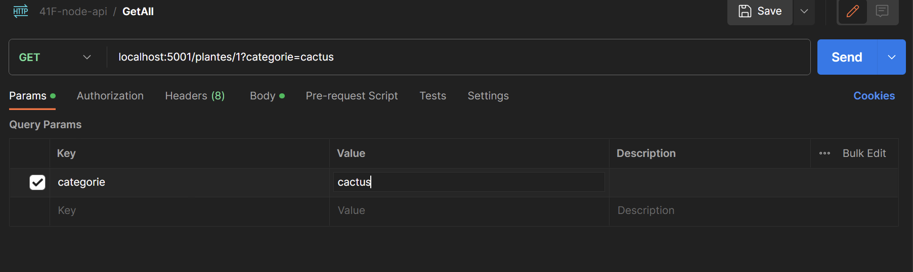

# Tester une API avec Postman

Postman est un outil qui permet de tester des API. Il est disponible sur le site officiel : https://www.postman.com/downloads/
Il permet de faire des requêtes HTTP et de voir les réponses. Il permet aussi de créer des collections de requêtes pour les réutiliser plus tard. Cela est utilise lorsque le front-end et le back-end sont développés séparément.

Dans le cours nous allons utiliser Postman pour tester notre API tout au long du développement.

Vous pouvez définir les méthodes HTTP, les headers, les paramètres et le body de la requête.

Vous pouvez aussi définir les headers et le body de la réponse. Assurez-vous de choisir "raw" et "JSON" pour le body de la réponse.

---

Dans le bas de la fenêtre, vous pouvez voir les informations de la réponse, le temps de réponse et le code de la réponse.
