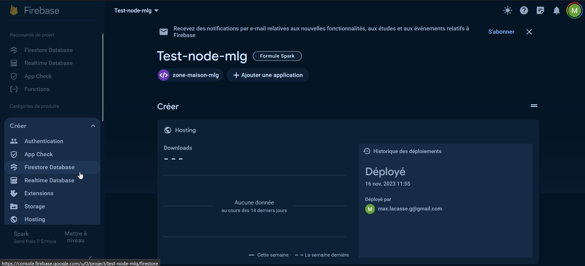
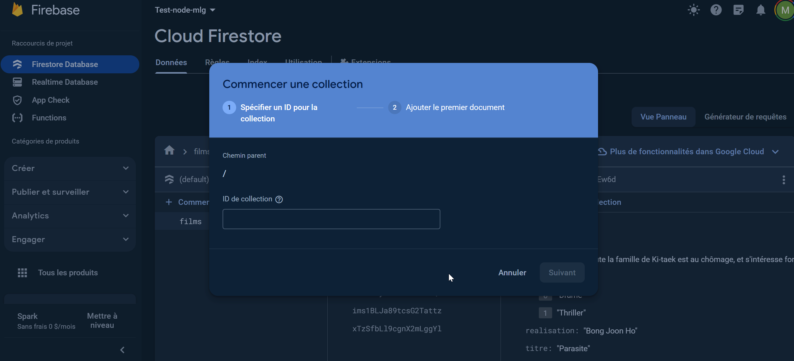
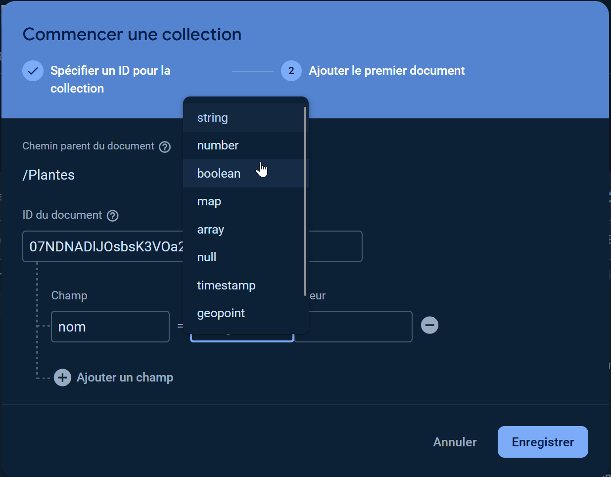
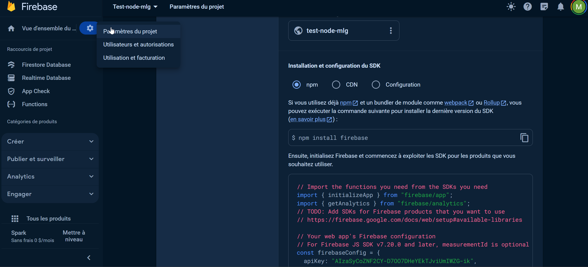

# Création d'une base de données Firestore

## Objectifs

-   Les bases de données non relationnelles (NoSQL)
-   Créer une base de données Firestore
-   Ajouter des données à une base de données Firestore
-   Connecter une application à une base de données Firestore
-   Récupérer des données d'une base de données Firestore
-   Mettre à jour des données d'une base de données Firestore
-   Supprimer des données d'une base de données Firestore

## Les bases de données NoSQL

Les bases de données NoSQL sont des bases de données qui ne sont pas relationnelles. Elles sont souvent utilisées pour des applications web qui ont besoin de stocker de grandes quantités de données.

Les bases de données NoSQL communes sont MongoDB, Firebase Firestore, Cassandra, Redis, etc.

Elles ont comme avantage d'être plus flexibles que les bases de données relationnelles et permettent de stocker des données de différentes formes. On peut stocker des données qui n'ont pas toutes les mêmes propriétés dans la même collection. Elles peuvent également être plus faciles à faire évoluer car elles sont plus flexibles.

Le désavantage des bases de données NoSQL est qu'elles ne sont pas aussi performantes que les bases de données relationnelles pour les requêtes complexes.Selon la base de données utilisée, il faut parfois faire plusieurs requêtes pour obtenir les données désirées.

Comme les données peuvent être stockées de différentes façons, il peut être complexes d'afficher les données de la façon désirée car elles ne sont pas structurées de la même façon.

### Points clés des bases de données non relationnelles (NoSQL)

-   Les données sont stockées dans des collections (équivalent des tables dans les bases de données relationnelles)
-   Les collections peuvent contenir des documents (équivalent des lignes dans les bases de données relationnelles)
-   Les documents sont des objets JSON
-   Les documents d'une même collection n'ont pas tous les mêmes propriétés et peuvent être de différents types
-   Les documents peuvent contenir des sous-collections (équivalent des sous-tables dans les bases de données relationnelles)

## Création d'une base de données Firestore

Dans le cours, nous allons utiliser Firebase Firestore car elle est facile à utiliser et elle est gratuite. Firebase Firestore est une base de données NoSQL qui est hébergée sur le cloud de Google.

1. Pour créer une base de données Firestore, il faut se rendre sur le site de [Firebase](https://firebase.google.com/) et créer un nouveau projet.

2. Une fois le projet créé, il faut se rendre dans la section "Database" et cliquer sur "Create Firestor database". **_ Ne pas choisir "Realtime Database" _**



## Ajouter des données à une base de données Firestore

Pour ajouter des données à une base de données Firestore, il faut créer une collection et ajouter des documents à cette collection.

1. Pour créer une collection, il faut cliquer sur le bouton "Start collection" et donner un nom à la collection.



2. Pour ajouter un document à la collection, il faut cliquer sur le bouton "Add document" et ajouter les propriétés du document. Les propriétés peuvent être de différents types.

Les types de données supportés par Firestore sont:

-   String
-   Number
-   Boolean
-   Array
-   Object
-   Date
-   Timestamp
-   Reference (pour faire référence à un autre document)



## Connecter une application à une base de données Firestore

Pour connecter une application à une base de données Firestore, il faut ajouter le SDK de Firebase à l'application. Le SDK de Firebase est un module Node.js qui permet de se connecter à une base de données Firestore. Vous trouverez les instruction dans la section `Vue d'ensemble` de la section `Database` de votre projet Firebase, sous l'onglet `Paramètres du projet`.



1. Pour ajouter le SDK de Firebase à l'application, il faut exécuter la commande `npm install firebase` dans le terminal.

2. Suivre ensuite les instructions pour ajouter le SDK de Firebase à l'application.

**_Attention, le code contient les accès à la base de données. Il ne faut pas le partager sur GitHub. Vous devrez ajouter les accès au fichier `.env` et les utiliser dans le fichier `server.js` avec process.env.la-clé._**

## Récupérer des données d'une base de données Firestore et Express

Pour récupérer des données d'une base de données Firestore, il faut utiliser la méthode `get()` de l'objet `db` qui est retourné par la méthode `firebase.firestore()`.

La méthode `get()` retourne une promesse qui contient un objet `QuerySnapshot`. Cet objet contient un tableau `docs` qui contient les documents de la collection.

https://firebase.google.com/docs/firestore/quickstart?hl=fr#node.js
https://console.firebase.google.com/u/0/project/test-node-mlg/settings/serviceaccounts/adminsdk

## Pour récupérer un seul document d'une base de données Firestore

Pour récupérer un seul document d'une base de données Firestore, il faut utiliser la méthode `doc()` de l'objet `db` qui est retourné par la méthode `firebase.firestore()`.

La méthode `doc()` prend en paramètre l'id du document à récupérer. Elle retourne un objet `DocumentSnapshot` qui contient le document.

Il est possible de récupérer les données du document avec la méthode `data()` de l'objet `DocumentSnapshot`.

Ex:

```js
router.get("/:id", async (req, res) => {
    try {
        const id = req.params.id;
        const doc = await db.collection("users").doc(id).get();
        const user = doc.data();
        res.json(user);
    } catch (err) {
        res.status(500).send(err);
    }
});
```

Pour filtrer les documents d'une collection, il faut utiliser la méthode `where()` de l'objet `db` qui est retourné par la méthode `firebase.firestore()`.

La méthode `where()` prend en paramètre le nom de la propriété à filtrer, l'opérateur de comparaison et la valeur à comparer. Elle retourne un objet `QuerySnapshot` qui contient les documents qui respectent le filtre.

Ex:

```js
router.get("/age/:age", async (req, res) => {
    try {
        const age = parseInt(req.params.age);
        const docs = await db.collection("users").where("age", "==", age).get();
        const users = [];
        docs.forEach((doc) => {
            const user = doc.data();
            users.push(user);
        });
        res.json(users);
    } catch (err) {
        res.status(500).send(err);
    }
});
```
